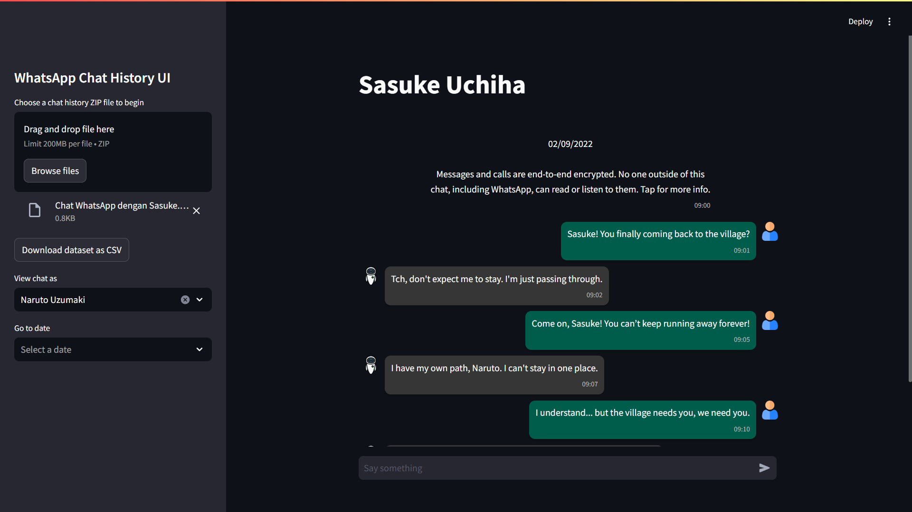

# **WhatsApp Chat History: Streamlit UI**



A Streamlit UI to display the contents of a ZIP file from WhatsApp Chat History (.TXT and attachment directory) in a chat-like view, making it easier for users to revisit and read their chat history again.

I created this project because a friend of mine lost their WhatsApp chat history without having a backup. This event inspired me to export the chat from my side and build a user interface (UI) that allows the chat to be read easily. Additionally, this project became an opportunity for me to hone my problem-solving skills and process log data (chat history) using regex techniques.

I hope you all enjoy the results of this project 😊


# **Project Structure**

This project is structured as follows:

- `./.streamlit`: Directory for Streamlit configuration files.
- `./data`: Directory for storing and accessing all data.
- `./static`: Directory for all the supporting files related to the user interface.
- `main.py`: The main Streamlit application file that serves as the entry point for the app.
- `parser.py`: Contains the `WhatsAppParser` class for parsing and processing the chat history content.
- `utils.py`: Contains utility functions to support various operations in the application.

This project was developed using `python==3.11.4` with the following dependencies:
- `pandas==2.2.3`
- `datetime==5.5`
- `streamlit==1.39.0`
- `st-theme==1.2.3`

> [!NOTE]
> See [requirements.txt](requirements.txt) for more details.


# **Get Started**

## **How to Get a WhatsApp Chat History ZIP file?**

To export a chat history from WhatsApp, you can do the following:
1. Open the chat you want to export
2. Tap the More options menu (three dots)
3. Select More
4. Tap Export chat
5. Choose whether to include media or export as text-only
6. Select a save destination on your device storage

> [!NOTE]
> For more information, please read the following official WhatsApp page:
> https://faq.whatsapp.com/1180414079177245/?helpref=uf_share

## **Installation**

To install the latest version of this code, please use this following command.

1. Git clone this project to the local computer
    ```shell
    git clone https://github.com/bayu-siddhi/whatsapp-chat-history-ui.git
    ```

2. In this project's root directory, create a virtual environment (e.g. with the name .venv) to install all the dependencies needed to run the project.
    ```shell
   python -m venv .venv    
    ```

3. Activate the .venv virtual environment.
    ```shell
    .venv\Scripts\activate
    ```

4. Install all the project dependencies.
    ```shell
    pip install -r requirements.txt
    ```

5. Run the streamlit app on the `main.py` file.
    ```shell
    streamlit run main.py
    ```

By following the steps above, you can successfully set up and run the WhatsApp Chat History UI locally. If you encounter any issues or have questions, please refer to the project's documentation or open an issue on the GitHub repository. Let me know if this application is helpful for you. Thank you! 😊
